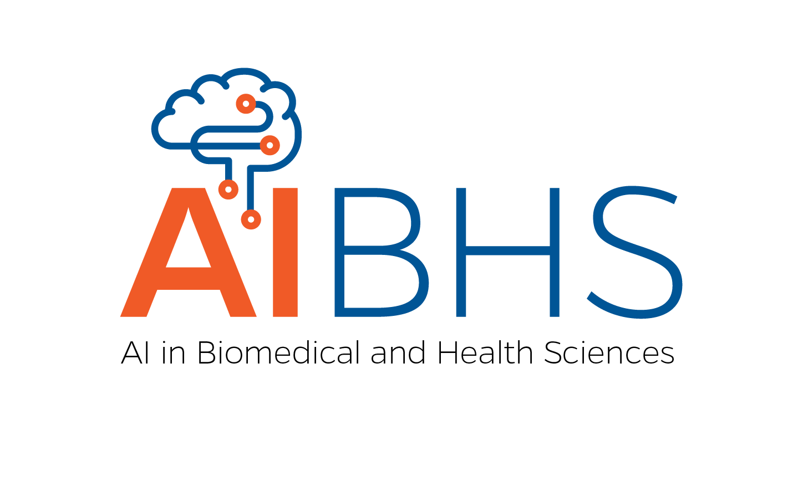

# AIBHS: Artificial Intelligence in Biomedical and Health Sciences

University of Florida College of Medicine &middot; offered through the [Intelligent Clinical Care Center (IC3)](https://ic3.center.ufl.edu/education/aibhs/)

AIBHS trains the workforce in healthcare and biomedical sciences to develop and implement trustworthy artificial
intelligence technologies — transforming digital patient care, translational research, and precision medicine.

**Quick facts**
- Master's degree, experiential learning graduate program
- Full-time completion: 1.5 years &middot; hybrid (online and face-to-face)
- Campuses in Gainesville and Jacksonville, FL
- Starts Fall 2026
- Open to traditional graduate students, working professionals, and combined professional/graduate degree students — full-time and part-time

- **[About](about.md)** — mission, program structure, key features, eligibility
- **[Staff](staff.md)** — program leadership and faculty
- **[Software Index](resources.md)** — every tool AIBHS courses touch, by scale
- **Apply:** via [ApplyWeb](https://www.applyweb.com/uflgrad/index.ftl)
- **Official program page:** [ic3.center.ufl.edu/education/aibhs](https://ic3.center.ufl.edu/education/aibhs/)

**Contact**
- Phone: 352-273-9009
- Email: ic3-center@ufl.edu
- Address: 1345 Center Drive, Gainesville, FL 32610

## AIBHS Courses

| Course | Teaching Staff | Link |
|---|---|---|
| CAI 5735: Applied Data Science in Health (Fall 2026) | Ashish Aggarwal, Scott Siegel | [Course site](https://uf-aibhs.github.io/cai5735/) |

Only one AIBHS course has a public site so far — add a row here as more come online.

---

Built with [Just the Class](https://github.com/kevinlin1/just-the-class). [Source on GitHub](https://github.com/UF-AIBHS/UF-AIBHS.github.io).
